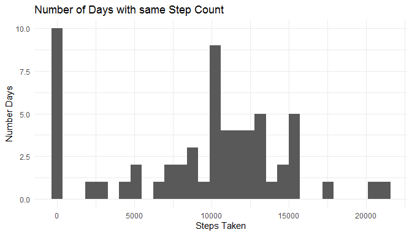
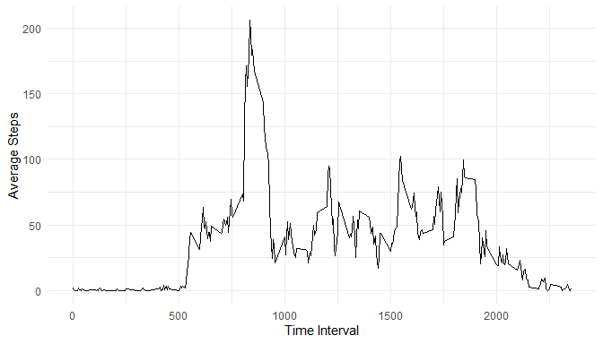
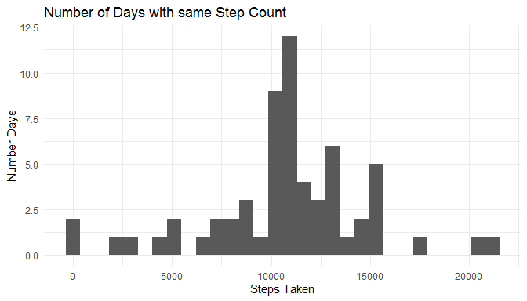
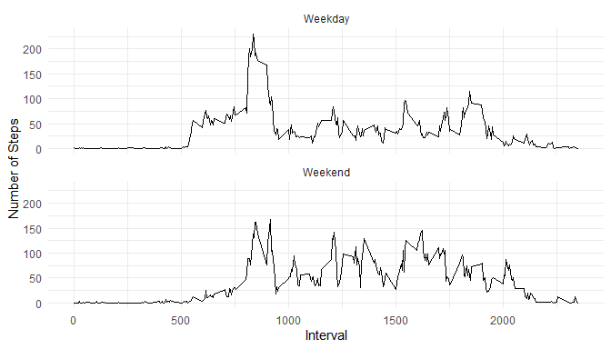

## Loading and preprocessing the data

Before starting with the analysis, these have been the options set and the operations made:


```r
library(tidyverse)
```

```
## -- Attaching packages --------------------------------------------- tidyverse 1.3.0 --
```

```
## v ggplot2 3.3.2     v purrr   0.3.4
## v tibble  3.0.3     v dplyr   1.0.0
## v tidyr   1.1.0     v stringr 1.4.0
## v readr   1.3.1     v forcats 0.5.0
```

```
## -- Conflicts ------------------------------------------------ tidyverse_conflicts() --
## x dplyr::filter() masks stats::filter()
## x dplyr::lag()    masks stats::lag()
```

```r
options(max.print = 50, scipen = 999)

unzip("./activity.zip")
activity <- read.csv("./activity.csv")
activity$date <- parse_date(activity$date, "%Y-%m-%d")
```


## What is mean total number of steps taken per day?

Following command calculates sum of steps taken per day:

```r
steps_by_day <- activity %>%
  group_by(date) %>%
  summarize(
    total_steps = sum(steps, na.rm = TRUE)
  )
```

```
## `summarise()` ungrouping output (override with `.groups` argument)
```

Histogram of steps taken per day:

```r
ggplot(steps_by_day, aes(total_steps))+
  geom_histogram()+
  theme_minimal()+
  labs(x="Steps Taken", y="Number Days", title="Number of Days with same Step Count")
```

```
## `stat_bin()` using `bins = 30`. Pick better value with `binwidth`.
```

<!-- -->


```r
mean_steps_by_date <- sum(activity$steps,na.rm = TRUE)/length(unique(activity$date))

median_steps_by_date <- median(steps_by_day$total_steps,na.rm=TRUE)
```

The mean is 9354.2295082 and the median is 10395

## What is the average daily activity pattern?

Temporal distribution of steps taken during a day

```r
steps_by_interval <- activity %>%
  group_by(interval)%>%
  summarize(
    avg_steps = mean(steps,na.rm = TRUE)
  )
```

```
## `summarise()` ungrouping output (override with `.groups` argument)
```

```r
ggplot(steps_by_interval,aes(interval,avg_steps))+
  geom_line()+
  theme_minimal()+
  labs(x="Time Interval",y="Average Steps","Average Steps per Time Interval")
```

<!-- -->


```r
max_interval <- arrange(steps_by_interval,desc(avg_steps))[1,1]
```

The 5-minute interval that cointains the maximum number of steps is 835

## Imputing missing values


```r
total_nas <- sum(is.na(activity$steps))
```

Total missing values were 2304

Missing values correction was made by using average steps per interval:

```r
activity_revised <- activity
  
for(i in 1:length(activity_revised$steps)){
  if(is.na(activity_revised$steps[i]) == TRUE) {
    activity_revised$steps[i] = filter(steps_by_interval, interval == activity_revised$interval[i])[[1,2]]
  } 
}
```

Distribution of the new data:

```r
steps_by_day_revised <- activity_revised %>%
  group_by(date) %>%
  summarize(
    total_steps = sum(steps, na.rm = TRUE)
  )
```

```
## `summarise()` ungrouping output (override with `.groups` argument)
```

```r
ggplot(steps_by_day_revised, aes(total_steps))+
  geom_histogram()+
  theme_minimal()+
  labs(x="Steps Taken", y="Number Days", title="Number of Days with same Step Count")
```

```
## `stat_bin()` using `bins = 30`. Pick better value with `binwidth`.
```

<!-- -->


```r
mean_steps_by_date_revised <- sum(activity_revised$steps,na.rm = TRUE)/length(unique(activity_revised$date))
median_steps_by_date_revised <- median(steps_by_day_revised$total_steps,na.rm=TRUE)
```

The average of steps of new data 10766.1886792 is and the median is 10766.1886792

## Are there differences in activity patterns between weekdays and weekends?

Creating new factor variable showing wheter data is from weekdays or weekends:

```r
day_week <- seq_along(activity_revised$date)

for(i in 1:length(activity_revised$date)){
  if(weekdays(activity_revised$date[i]) %in% c("Saturday","Sunday")) {
    day_week[i] = "Weekend"
  } else {
    day_week[i] = "Weekday"
  }
}

day_week <- factor(day_week,c("Weekday","Weekend"))
```

Temporal distribution of steps during weekdays and weekends:

```r
activity_revised$day_week <- day_week

steps_by_intervay_and_weekday <- activity_revised %>%
  group_by(interval, day_week) %>%
  summarize(
    avg_steps = mean(steps)
  )
```

```
## `summarise()` regrouping output by 'interval' (override with `.groups` argument)
```

```r
ggplot(steps_by_intervay_and_weekday, aes(interval,avg_steps))+
  geom_line()+
  theme_minimal()+
  facet_wrap(~day_week,nrow=2)+
  labs(x="Interval",y="Number of Steps")
```

<!-- -->
